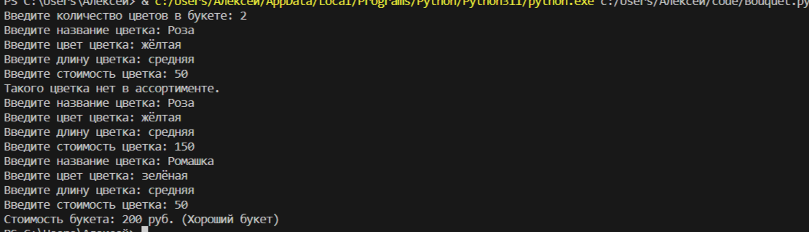

# OOP2_2    
    
## Исполнитель    
ФТ-220007 Фадеев Алексей    
    
## Задача    
1) Необходимо создать программу, в которой используя классы и объектов классов организована следующая работа.    
2) Программа создает букет из заранее известного числа цветов.    
3) Пользователь сам выбирает сколько цветков и какого вида они будут в букете.    
4) При создании букета необходимо подобрать цветки так, чтобы они были одной длинны.    
5) Букет считается хорошим, если в нем все цветы одного цвета, или цветов не более 3.    
6) Каждый Вид Цветка состоит из названия, цвета и длинны.    
7) *После составления букета программа считает его стоимость.
    
## Цветы в магазине    
[Цветы в наличии.xlsx](https://github.com/Kurogitsunee/OOP2_2/blob/main/Цветы%20в%20наличии.xlsx)   
    
## Тест    

